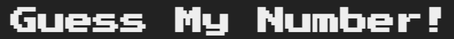

# Guess My Number!

<p align="center">
  
</p>

**Guess My Number** is a fun and interactive number-guessing game. The objective is to guess a secret number between 1 and 20. The game provides feedback for each guess to help you find the correct number!

---

## 🎮 How to Play

1. **Start the Game**: When you load the game, a random number between 1 and 20 is generated in secret. Your goal is to guess this number!

2. **Making a Guess**:
   - Enter your guess in the input box and click **Check!** or press **Enter** to submit.
   - Based on your guess, you will receive feedback:
     - **"Too low!"** if your guess is below the correct number.
     - **"Too high!"** if your guess is above the correct number.
     - **"You are right!"** if you guess the correct number and win the game!

3. **Scoring**:
   - Each incorrect guess decreases your **Score** by 1.
   - If you guess correctly, your **Score** is compared to the **Highscore**. If your current score is higher, it becomes your new **Highscore**.
   - If your **Score** reaches 0, you lose the game.

4. **Restarting the Game**:
   - Click the **Again!** button or press **Escape** to reset the game.
   - A new random number will be generated, and your **Score** will reset to 10.

---

## 🔥 Game Controls

- **Enter**: Submit your guess.
- **Escape**: Restart the game.
- **Up Arrow**: Increase the guessed number (when input is focused).
- **Down Arrow**: Decrease the guessed number (when input is focused).

---

## 📸 Screenshots

Here are some screenshots showing various stages of the game:

1. **Starting Screen**
   - 

3. **Winning Screen**
   - 

4. **Game Over Screen**
   - 

---

## 🚀 Getting Started

Follow these steps to set up and play the game locally:

1. Clone the repository:
   ```bash
   git clone https://github.com/your-username/your-repo-name.git
2. Navigate to the project directory:
   ```bash
   cd your-repo-name/guessGame
3. Open `index.html` in your preferred browser to start the game.

---

## 🛠️ Technologies Used

- HTML for structuring the game interface.
- CSS for styling and layout.
- JavaScript for game logic, user interaction, and feedback.

---

## 🤝 Contributing

Contributions are welcome! Feel free to open issues or submit pull requests to improve the game or suggest new features.

---

## 📜 License

This project is open-source and available under the MIT License.

---

Enjoy playing Guess My Number, and happy guessing!!
